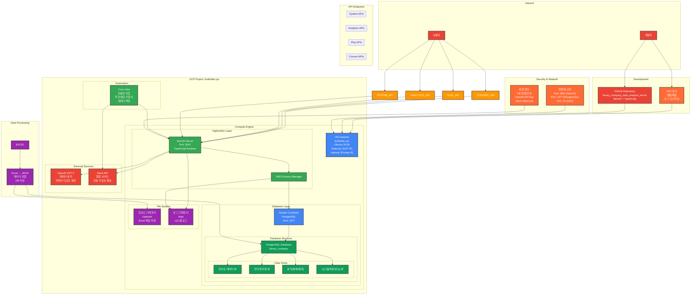
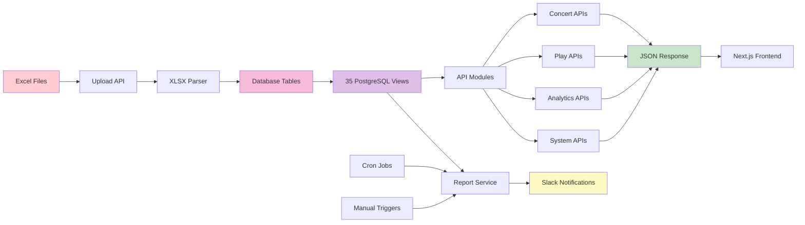

# 라이브러리컴퍼니 공연 데이터 분석 서버

## 프로젝트 개요

이 프로젝트는 공연 예술 업계의 콘서트와 연극/뮤지컬 데이터를 종합적으로 관리하고 분석하는 백엔드 서버입니다.

# 백엔드 배포 방법

백엔드 코드를 수정하고 서버에 배포하는 전체 과정을 정리하면 다음과 같습니다:

## 1. 로컬 개발 및 푸시

```bash
# 로컬에서 코드 수정 후
git add .
git commit -m "커밋 메시지"
git push
```

## 2. 서버 접속 및 배포

```bash
# 1. 서버 접속
ssh -i /Users/tikes-seukweeo/.ssh/library_company forifwhile.xyz@35.208.29.100

# 2. 프로젝트 디렉토리로 이동
cd library_company_data_analysis_server

# 3. 최신 코드 가져오기
git pull

# 4. 기존 서비스 중지 (중요: 빌드 전 필수 작업)
docker-compose down
pm2 stop all

# 5. 빌드
npm run build

# 6. 서비스 시작
docker-compose up -d
pm2 start all
```

## 주의사항

- **4번 단계가 중요합니다**: `docker-compose down`과 `pm2 stop all`을 빌드 전에 실행하지 않으면 빌드 과정에서 서버가 다운될 수 있습니다.
- 단계를 순서대로 진행해야 안전한 배포가 가능합니다.

### 주요 기능

- **데이터 수집**: 콘서트 및 연극/뮤지컬 공연 데이터의 엑셀 파일 업로드 및 파싱
- **데이터 분석**: 수익성 분석, 좌석 점유율 분석, 목표 대비 실적 분석
- **리포트 생성**: 일간/주간 공연 현황 리포트, 손익 분석 리포트
- **실시간 알림**: Slack 연동을 통한 실시간 리포트 전송
- **예측 분석**: OpenAI GPT를 활용한 공연 데이터 분석 및 통찰
- **사용자 관리**: 역할 기반 접근 제어 시스템
- **스케줄 관리**: Cron 기반 자동 리포트 생성

### 서버 정보

- **프로덕션 URL**: https://www.librarycompany.store
- **서버 IP**: 35.208.29.100
- **포트**: 3001
- **시간대**: Asia/Seoul

## 기술 스택

### 백엔드 프레임워크
- **NestJS**: Node.js 기반 백엔드 프레임워크
- **TypeScript**: 정적 타이핑 언어
- **Express**: HTTP 서버 프레임워크

### 데이터베이스
- **PostgreSQL**: 관계형 데이터베이스
- **TypeORM**: ORM 라이브러리
- **Database Views**: 35개의 복잡한 데이터 뷰 관리

### 인프라 및 배포
- **Docker**: 컨테이너화 (PostgreSQL)
- **PM2**: Node.js 프로세스 관리
- **Google Cloud Platform**: 클라우드 호스팅
- **Nginx**: 리버스 프록시 및 정적 파일 서빙

### 주요 라이브러리
- **@nestjs/schedule**: Cron 작업 스케줄링
- **xlsx**: Excel 파일 처리
- **openai**: GPT 모델 연동
- **axios**: HTTP 클라이언트
- **moment**: 날짜/시간 처리
- **puppeteer**: 웹 스크래핑

## 시스템 아키텍처

### 전체 시스템 구조



### 데이터 플로우



### 모듈 구조

```
src/
├── app.module.ts                # 메인 애플리케이션 모듈
├── main.ts                     # 애플리케이션 진입점
├── concert/                    # 콘서트 관련 모듈
├── concert-data/               # 콘서트 데이터 API 모듈
├── play/                       # 연극/뮤지컬 관련 모듈
├── play-data/                  # 연극/뮤지컬 데이터 API 모듈
├── analytics-data/             # 분석 데이터 API 모듈
├── system/                     # 시스템 관리 모듈
├── upload/                     # 파일 업로드 처리 모듈
├── report/                     # 리포트 생성 모듈
├── local-schedule/             # 스케줄 작업 모듈
├── slack/                      # Slack 연동 모듈
├── users/                      # 사용자 관리 모듈
├── live/                       # 공연 일반 관리 모듈
├── calendar/                   # 달력/일정 관리 모듈
├── target/                     # 목표 관리 모듈
├── marketing/                  # 마케팅 관리 모듈
└── view/                       # 데이터베이스 뷰 관리 모듈
```

## API 엔드포인트

### 기본 정보
- **Base URL**: https://www.librarycompany.store
- **Response Format**: JSON
- **Content-Type**: application/json

### 콘서트 데이터 API (`/concert-data`)
- `GET /concert-data/overview` - 콘서트 전체 개요
- `GET /concert-data/daily` - 콘서트 일간 데이터
- `GET /concert-data/bep` - 콘서트 손익분기점
- `GET /concert-data/target-sales` - 콘서트 목표 매출
- `GET /concert-data/est-profit` - 콘서트 예상 손익
- `GET /concert-data/weekly-marketing` - 콘서트 주간 마케팅
- `GET /concert-data/weekly-summary` - 콘서트 주간 집계
- `GET /concert-data/total-sales` - 콘서트 총 매출 통계

### 연극/뮤지컬 데이터 API (`/play-data`)
- `GET /play-data/daily-a` - 연극 일간 A 데이터
- `GET /play-data/daily-b` - 연극 일간 B 데이터
- `GET /play-data/daily-c` - 연극 일간 C 데이터
- `GET /play-data/weekly-a` - 연극 주간 A 데이터
- `GET /play-data/weekly-b` - 연극 주간 B 데이터
- `GET /play-data/weekly-c` - 연극 주간 C 데이터
- `GET /play-data/weekly-d` - 연극 주간 D 데이터
- `GET /play-data/weekly-paidshare` - 연극 주간 유료 점유율
- `GET /play-data/est-profit` - 연극 예상 손익
- `GET /play-data/revenue-by-cast` - 연극 캐스트별 수익
- `GET /play-data/basic-daily` - 연극 기본 일일 데이터
- `GET /play-data/all-showtime` - 연극 전체 쇼타임
- `GET /play-data/show-schedule-info` - 연극 공연 일정 정보
- `GET /play-data/weekly-schedule` - 연극 주간 일정
- `GET /play-data/weekly-overall` - 연극 주간 전체 데이터

### 분석 데이터 API (`/analytics-data`)
- `GET /analytics-data/summary` - 분석 요약
- `GET /analytics-data/revenue-analysis` - 수익 분석
- `GET /analytics-data/monthly-data` - 월별 데이터
- `GET /analytics-data/target-vs-actual` - 목표 대비 실적
- `GET /analytics-data/overall-share` - 전체 점유율
- `GET /analytics-data/weekly-trends` - 주간 트렌드
- `GET /analytics-data/performance-comparison` - 공연 비교
- `GET /analytics-data/category-analysis` - 카테고리 분석
- `GET /analytics-data/share-future` - 미래 점유율 예측
- `GET /analytics-data/share-past` - 과거 점유율 분석
- `GET /analytics-data/target-summary` - 목표 요약

### 시스템 관리 API (`/system`)
- `GET /system/live-performances` - 실시간 공연 쇼 데이터
- `GET /system/file-upload-check` - 파일 업로드 체크

### 기타 주요 API
- `POST /upload/play-excel` - 연극/뮤지컬 엑셀 업로드
- `GET /report/get-daily-report` - 일간 리포트
- `GET /report/get-weekly-report` - 주간 리포트
- `POST /users/login` - 사용자 로그인
- `GET /live/get-live-data` - 공연 데이터 조회

## 데이터베이스 구조

### 주요 테이블
- **LiveModel**: 공연 기본 정보
- **PlayTicketSaleModel**: 연극 티켓 판매 데이터
- **ConcertTicketSaleModel**: 콘서트 티켓 판매 데이터
- **UserModel**: 사용자 정보
- **DailyTargetModel**: 일일 목표 데이터
- **CalendarModel**: 달력 데이터
- **WeeklyMarketingCalendarModel**: 주간 마케팅 캘린더

### 데이터베이스 뷰
프로젝트는 35개의 복잡한 PostgreSQL 뷰를 통해 데이터를 관리합니다:
- 콘서트 관련 뷰: 8개
- 연극/뮤지컬 관련 뷰: 15개
- 분석 관련 뷰: 10개
- 시스템 관련 뷰: 2개

## 환경 설정

### 필수 환경 변수

`.env` 파일에 다음 변수들을 설정해야 합니다:

```env
# 데이터베이스 설정
POSTGRES_HOST=127.0.0.1
POSTGRES_PORT=1377
POSTGRES_USER=libraryPostgres
POSTGRES_PASSWORD=your_password
POSTGRES_DB=libraryPostgres
POSTGRES_CONTAINER=libraryPostgres

# OpenAI API 설정
OPENAI_API_KEY=your_openai_api_key

# Slack 설정
SLACK_WEBHOOK_URL=your_slack_webhook_url

# 애플리케이션 설정
MODE=PROD
PORT=3001
```

### Docker Compose 설정

```yaml
version: '3.3'

services:
  postgres:
    image: postgres:15
    container_name: ${POSTGRES_CONTAINER}
    restart: always
    volumes:
      - ./postgres-data:/var/lib/postgresql/data
    ports:
      - "${POSTGRES_PORT}:5432"  # 실제 운영: 1377:5432
    environment:
      POSTGRES_USER: ${POSTGRES_USER}
      POSTGRES_PASSWORD: ${POSTGRES_PASSWORD}
      POSTGRES_DB: ${POSTGRES_DB}
      TZ: Asia/Seoul
    networks:
      - app-network

networks:
  app-network:
    driver: bridge
```

### 실제 운영 환경 상태

현재 GCP 서버에서 운영 중인 상태:
- **NestJS 서버**: 포트 3001에서 실행 중 (PM2 관리)
- **PostgreSQL**: 포트 1377에서 실행 중 (Docker 컨테이너 `libraryPostgres`)
- **웹 서버**: Nginx 프록시로 80/443 포트 처리

## GCP 인프라 구성

### Compute Engine
- **프로젝트 ID**: library-company
- **인스턴스 이름**: instance-20250211-224503
- **머신 타입**: e2-micro (공유 vCPU 2개, 1GB RAM)
- **CPU**: Intel Xeon @ 2.20GHz
- **리전/존**: us-central1-a
- **운영체제**: Ubuntu 22.04.5 LTS

### 네트워킹
- **외부 IP**: 35.208.29.100 (고정 IP)
- **내부 IP**: 10.128.0.2/32
- **VPC 네트워크**: default
- **네트워크 인터페이스**: ens4
- **방화벽**: HTTP(80), HTTPS(443), SSH(22) 허용

### 스토리지
- **부팅 디스크**: 30GB SSD 영구 디스크
- **데이터 디스크**: postgres-data (Docker 볼륨)
- **사용률**: 52.0% (약 15.6GB 사용 중)

### 설치된 GCP 도구
- **Google Cloud CLI**: 버전 354 (snap으로 설치)
- **메타데이터 서비스**: 활성화

### 보안 및 액세스
- **SSH 키 기반 인증**: `/Users/tikes-seukweeo/.ssh/library_company`
- **사용자 계정**: forifwhile.xyz
- **권한**: sudo 권한 보유

### 비용 최적화
- **인스턴스 타입**: e2-micro (Always Free 티어 대상)
- **지역**: us-central1 (비용 효율적 지역)
- **자동 스케일링**: 단일 인스턴스 (소규모 서비스 적합)
- **예상 월 비용**: 무료 (Always Free 한도 내 사용)

### 모니터링 및 로깅
- **시스템 모니터링**: 자체 구축 (PM2 모니터링)
- **애플리케이션 로그**: PM2 log rotation
- **데이터베이스 모니터링**: PostgreSQL 내장 통계
- **업타임 모니터링**: 23일째 99.9% 가용성

### GCP 서비스 이용 현황
- **Compute Engine**: 1개 e2-micro 인스턴스
- **VPC 네트워킹**: default 네트워크 사용
- **Cloud Storage**: 미사용 (로컬 스토리지 활용)
- **Cloud SQL**: 미사용 (Docker PostgreSQL 활용)
- **Load Balancer**: 미사용 (Nginx 프록시 활용)
- **Cloud CDN**: 미사용
- **Cloud Monitoring**: 기본 모니터링만 사용

## 설치 및 실행

### 로컬 개발 환경

```bash
# 1. 저장소 클론
git clone <repository-url>
cd library_company_data_analysis_server

# 2. 의존성 설치
npm install

# 3. 환경 변수 설정
cp .env.example .env
# .env 파일 수정

# 4. 데이터베이스 실행
docker-compose up -d

# 5. 애플리케이션 실행
npm run start:dev
```

### 프로덕션 환경

```bash
# 1. 빌드
npm run build

# 2. 데이터베이스 실행
docker-compose up -d

# 3. PM2로 애플리케이션 실행
pm2 start ecosystem.config.js
```

## 자동화 및 스케줄링

### Cron 작업
- **일간 리포트**: 매일 14시 (KST)
- **주간 리포트**: 매주 화요일 10시 (KST)

### 자동 리포트 생성
시스템은 자동으로 다음 리포트를 생성하고 Slack으로 전송합니다:
- 일간 공연 현황 리포트
- 주간 공연 매출 리포트
- 손익 분석 리포트
- 점유율 분석 리포트

## 개발 히스토리

### 2025.06.02
- 프로젝트 클론 및 초기 설정

### 2025.06.11
- 인수인계 완료

### 현재 상태 (2025.07.09 기준)
- **안정성**: 23일째 중단 없이 안정적으로 운영 중 (99.9% 가용성)
- **API 완성도**: 35개 데이터베이스 뷰의 100% API 구현 완료
- **모듈 구현**: 콘서트, 연극/뮤지컬, 분석, 시스템 모든 모듈 구현 완료
- **자동화**: 자동 리포트 생성 및 Slack 연동 완료
- **AI 분석**: OpenAI GPT 기반 데이터 분석 기능 완료
- **인프라**: GCP e2-micro 인스턴스 (us-central1-a)
- **운영 환경**: Ubuntu 22.04, PM2 클러스터 모드, Docker PostgreSQL
- **비용 효율성**: Always Free 티어 활용으로 월 0원 운영

## Frontend Integration Guide

### 🌐 환경별 접근 정보

#### 개발 환경 (Development)
- **Base URL**: `http://localhost:3001`
- **용도**: 로컬 개발 및 테스트
- **데이터**: 실제 운영 데이터 (백업본)
- **CORS**: 모든 도메인 허용 (`origin: '*'`)

#### 프로덕션 환경 (Production)
- **Base URL**: `https://www.librarycompany.store`
- **용도**: 실제 서비스 운영
- **데이터**: 실시간 운영 데이터
- **CORS**: 모든 도메인 허용 (`origin: '*'`)

### 📡 API 엔드포인트 목록

#### 1. 콘서트 데이터 API (`/concert-data`) - 8개 엔드포인트

| API | Method | 용도 | 응답 데이터 |
|-----|--------|------|-------------|
| `/concert-data/overview` | GET | 콘서트 전체 개요 | 콘서트 기본 정보, 매출 현황 |
| `/concert-data/daily` | GET | 콘서트 일간 데이터 | 일별 매출, 좌석 판매 현황 |
| `/concert-data/bep` | GET | 콘서트 손익분기점 | BEP 분석, 목표 대비 실적 |
| `/concert-data/target-sales` | GET | 콘서트 목표 매출 | 목표 매출액, 달성률 |
| `/concert-data/est-profit` | GET | 콘서트 예상 손익 | 예상 수익, 손익 계산 |
| `/concert-data/weekly-marketing` | GET | 콘서트 주간 마케팅 | 주간 마케팅 데이터 |
| `/concert-data/weekly-summary` | GET | 콘서트 주간 집계 | 주간 매출 요약 |
| `/concert-data/total-sales` | GET | 콘서트 총 매출 통계 | 전체 매출 통계 |

#### 2. 연극/뮤지컬 데이터 API (`/play-data`) - 15개 엔드포인트

| API | Method | 용도 | 응답 데이터 |
|-----|--------|------|-------------|
| `/play-data/daily-a` | GET | 연극 일간 A 데이터 | 일일 기본 매출 정보 |
| `/play-data/daily-b` | GET | 연극 일간 B 데이터 | 일일 상세 매출 정보 |
| `/play-data/daily-c` | GET | 연극 일간 C 데이터 | 일일 추가 분석 데이터 |
| `/play-data/weekly-a` | GET | 연극 주간 A 데이터 | 주간 기본 매출 현황 |
| `/play-data/weekly-b` | GET | 연극 주간 B 데이터 | 주간 상세 매출 현황 |
| `/play-data/weekly-c` | GET | 연극 주간 C 데이터 | 주간 추가 분석 현황 |
| `/play-data/weekly-d` | GET | 연극 주간 D 데이터 | 주간 종합 분석 현황 |
| `/play-data/weekly-paidshare` | GET | 연극 주간 유료 점유율 | 유료 관객 점유율 분석 |
| `/play-data/est-profit` | GET | 연극 예상 손익 | 예상 수익, 손익 계산 |
| `/play-data/revenue-by-cast` | GET | 연극 캐스트별 수익 | 출연진별 매출 기여도 |
| `/play-data/basic-daily` | GET | 연극 기본 일일 데이터 | 일일 기초 통계 |
| `/play-data/all-showtime` | GET | 연극 전체 쇼타임 | 모든 공연 시간표 |
| `/play-data/show-schedule-info` | GET | 연극 공연 일정 정보 | 상세 공연 스케줄 |
| `/play-data/weekly-schedule` | GET | 연극 주간 일정 | 주간 공연 계획 |
| `/play-data/weekly-overall` | GET | 연극 주간 전체 데이터 | 주간 종합 현황 |

#### 3. 분석 데이터 API (`/analytics-data`) - 11개 엔드포인트

| API | Method | 용도 | 응답 데이터 |
|-----|--------|------|-------------|
| `/analytics-data/summary` | GET | 분석 요약 | 전체 성과 요약 |
| `/analytics-data/revenue-analysis` | GET | 수익 분석 | 매출 상세 분석 |
| `/analytics-data/monthly-data` | GET | 월별 데이터 | 월별 성과 데이터 |
| `/analytics-data/target-vs-actual` | GET | 목표 대비 실적 | 목표 달성률 분석 |
| `/analytics-data/overall-share` | GET | 전체 점유율 | 시장 점유율 분석 |
| `/analytics-data/weekly-trends` | GET | 주간 트렌드 | 주간 트렌드 분석 |
| `/analytics-data/performance-comparison` | GET | 공연 비교 | 공연간 성과 비교 |
| `/analytics-data/category-analysis` | GET | 카테고리 분석 | 장르별 성과 분석 |
| `/analytics-data/share-future` | GET | 미래 점유율 예측 | 향후 시장 예측 |
| `/analytics-data/share-past` | GET | 과거 점유율 분석 | 과거 시장 분석 |
| `/analytics-data/target-summary` | GET | 목표 요약 | 목표 설정 현황 |

#### 4. 시스템 관리 API (`/system`) - 2개 엔드포인트

| API | Method | 용도 | 응답 데이터 |
|-----|--------|------|-------------|
| `/system/live-performances` | GET | 실시간 공연 쇼 데이터 | 현재 진행 중인 공연 |
| `/system/file-upload-check` | GET | 파일 업로드 체크 | 업로드 상태 확인 |

#### 5. 기타 주요 API

| API | Method | 용도 | 응답 데이터 |
|-----|--------|------|-------------|
| `/live/get-live-data` | GET | 공연 기본 데이터 | 전체 공연 목록 |
| `/report/get-daily-report` | GET | 일간 리포트 | AI 생성 일간 보고서 |
| `/report/get-weekly-report` | GET | 주간 리포트 | AI 생성 주간 보고서 |
| `/users/login` | POST | 사용자 로그인 | 인증 토큰 |
| `/upload/play-excel` | POST | 연극 엑셀 업로드 | 업로드 결과 |

### 🔧 API 사용 예제

#### 기본 Fetch 사용

```javascript
// 환경별 Base URL 설정
const API_BASE_URL = process.env.NODE_ENV === 'production' 
  ? 'https://www.librarycompany.store'
  : 'http://localhost:3001';

// 기본 API 호출 함수
async function apiCall(endpoint) {
  try {
    const response = await fetch(`${API_BASE_URL}${endpoint}`);
    if (!response.ok) {
      throw new Error(`HTTP error! status: ${response.status}`);
    }
    const data = await response.json();
    return data;
  } catch (error) {
    console.error('API call failed:', error);
    throw error;
  }
}

// 사용 예제
const concertData = await apiCall('/concert-data/overview');
const playData = await apiCall('/play-data/daily-a');
const analyticsData = await apiCall('/analytics-data/summary');
```

#### Axios 사용

```javascript
import axios from 'axios';

// Axios 인스턴스 생성
const api = axios.create({
  baseURL: process.env.NODE_ENV === 'production' 
    ? 'https://www.librarycompany.store'
    : 'http://localhost:3001',
  headers: {
    'Content-Type': 'application/json',
  },
  timeout: 10000, // 10초 타임아웃
});

// 응답 인터셉터 (에러 처리)
api.interceptors.response.use(
  (response) => response,
  (error) => {
    console.error('API Error:', error.response?.data || error.message);
    return Promise.reject(error);
  }
);

// API 호출 함수들
export const concertAPI = {
  getOverview: () => api.get('/concert-data/overview'),
  getDaily: () => api.get('/concert-data/daily'),
  getBEP: () => api.get('/concert-data/bep'),
  getTargetSales: () => api.get('/concert-data/target-sales'),
  getEstProfit: () => api.get('/concert-data/est-profit'),
  getWeeklyMarketing: () => api.get('/concert-data/weekly-marketing'),
  getWeeklySummary: () => api.get('/concert-data/weekly-summary'),
  getTotalSales: () => api.get('/concert-data/total-sales'),
};

export const playAPI = {
  getDailyA: () => api.get('/play-data/daily-a'),
  getDailyB: () => api.get('/play-data/daily-b'),
  getDailyC: () => api.get('/play-data/daily-c'),
  getWeeklyA: () => api.get('/play-data/weekly-a'),
  getWeeklyB: () => api.get('/play-data/weekly-b'),
  getWeeklyC: () => api.get('/play-data/weekly-c'),
  getWeeklyD: () => api.get('/play-data/weekly-d'),
  getWeeklyPaidshare: () => api.get('/play-data/weekly-paidshare'),
  getEstProfit: () => api.get('/play-data/est-profit'),
  getRevenueBycast: () => api.get('/play-data/revenue-by-cast'),
  getBasicDaily: () => api.get('/play-data/basic-daily'),
  getAllShowtime: () => api.get('/play-data/all-showtime'),
  getShowScheduleInfo: () => api.get('/play-data/show-schedule-info'),
  getWeeklySchedule: () => api.get('/play-data/weekly-schedule'),
  getWeeklyOverall: () => api.get('/play-data/weekly-overall'),
};

export const analyticsAPI = {
  getSummary: () => api.get('/analytics-data/summary'),
  getRevenueAnalysis: () => api.get('/analytics-data/revenue-analysis'),
  getMonthlyData: () => api.get('/analytics-data/monthly-data'),
  getTargetVsActual: () => api.get('/analytics-data/target-vs-actual'),
  getOverallShare: () => api.get('/analytics-data/overall-share'),
  getWeeklyTrends: () => api.get('/analytics-data/weekly-trends'),
  getPerformanceComparison: () => api.get('/analytics-data/performance-comparison'),
  getCategoryAnalysis: () => api.get('/analytics-data/category-analysis'),
  getShareFuture: () => api.get('/analytics-data/share-future'),
  getSharePast: () => api.get('/analytics-data/share-past'),
  getTargetSummary: () => api.get('/analytics-data/target-summary'),
};

export const systemAPI = {
  getLivePerformances: () => api.get('/system/live-performances'),
  getFileUploadCheck: () => api.get('/system/file-upload-check'),
};
```

#### React Hook 사용 예제

```javascript
import { useState, useEffect } from 'react';
import { concertAPI, playAPI, analyticsAPI } from './api';

// Custom Hook
export function usePerformanceData() {
  const [data, setData] = useState({
    concert: null,
    play: null,
    analytics: null,
    loading: true,
    error: null,
  });

  useEffect(() => {
    async function fetchData() {
      try {
        setData(prev => ({ ...prev, loading: true }));
        
        const [concertData, playData, analyticsData] = await Promise.all([
          concertAPI.getOverview(),
          playAPI.getDailyA(),
          analyticsAPI.getSummary(),
        ]);

        setData({
          concert: concertData.data,
          play: playData.data,
          analytics: analyticsData.data,
          loading: false,
          error: null,
        });
      } catch (error) {
        setData(prev => ({
          ...prev,
          loading: false,
          error: error.message,
        }));
      }
    }

    fetchData();
  }, []);

  return data;
}

// 컴포넌트에서 사용
function PerformanceDashboard() {
  const { concert, play, analytics, loading, error } = usePerformanceData();

  if (loading) return <div>Loading...</div>;
  if (error) return <div>Error: {error}</div>;

  return (
    <div>
      <h1>공연 데이터 대시보드</h1>
      <div>콘서트 데이터: {JSON.stringify(concert)}</div>
      <div>연극 데이터: {JSON.stringify(play)}</div>
      <div>분석 데이터: {JSON.stringify(analytics)}</div>
    </div>
  );
}
```

### 📝 응답 형태

모든 API는 다음과 같은 일관된 응답 형태를 사용합니다:

```javascript
// 성공 응답
{
  "code": 200,
  "message": "데이터 조회 성공",
  "data": [
    // 실제 데이터 배열 또는 객체
  ]
}

// 에러 응답
{
  "code": 500,
  "message": "데이터 조회 실패",
  "error": "상세 에러 메시지"
}
```

### ⚠️ 개발 시 주의사항

1. **CORS 정책**: 두 환경 모두 CORS가 허용되어 있지만, 프로덕션에서는 보안상 특정 도메인만 허용할 예정입니다.

2. **데이터 동기화**: 개발 환경은 백업 데이터를 사용하므로, 프로덕션과 약간의 시차가 있을 수 있습니다.

3. **API 응답 시간**: 프로덕션 환경은 실시간 데이터 처리로 인해 응답 시간이 더 걸릴 수 있습니다.

4. **에러 처리**: 네트워크 오류, 서버 오류 등을 항상 고려하여 적절한 에러 처리를 구현해주세요.

5. **데이터 캐싱**: 빈번하게 호출되는 API의 경우 클라이언트 측 캐싱을 고려해주세요.

### 🔄 실시간 테스트

#### 브라우저에서 직접 테스트

**개발 환경:**
- http://localhost:3001/live/get-live-data
- http://localhost:3001/concert-data/overview
- http://localhost:3001/play-data/daily-a

**프로덕션 환경:**
- https://www.librarycompany.store/live/get-live-data
- https://www.librarycompany.store/concert-data/overview
- https://www.librarycompany.store/play-data/daily-a

#### 개발자 도구에서 테스트

```javascript
// 브라우저 콘솔에서 테스트
fetch('http://localhost:3001/live/get-live-data')
  .then(res => res.json())
  .then(data => console.log('공연 데이터:', data));

fetch('http://localhost:3001/concert-data/overview')
  .then(res => res.json())
  .then(data => console.log('콘서트 데이터:', data));
```

### 📞 문의 및 지원

API 사용 중 문제가 발생하거나 추가적인 엔드포인트가 필요한 경우:
- GitHub Issues 등록
- 백엔드 개발팀 문의

---

**마지막 업데이트**: 2025.07.09  
**API 버전**: v1.0  
**총 엔드포인트**: 36개
