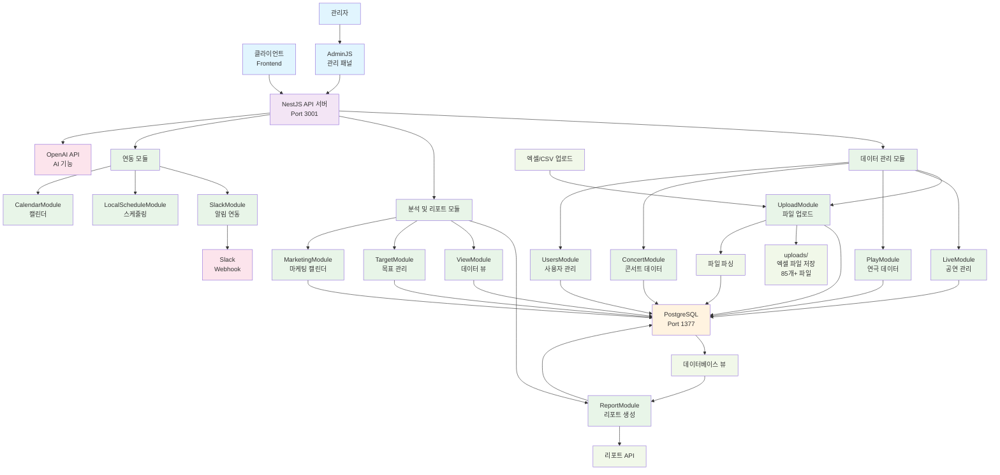
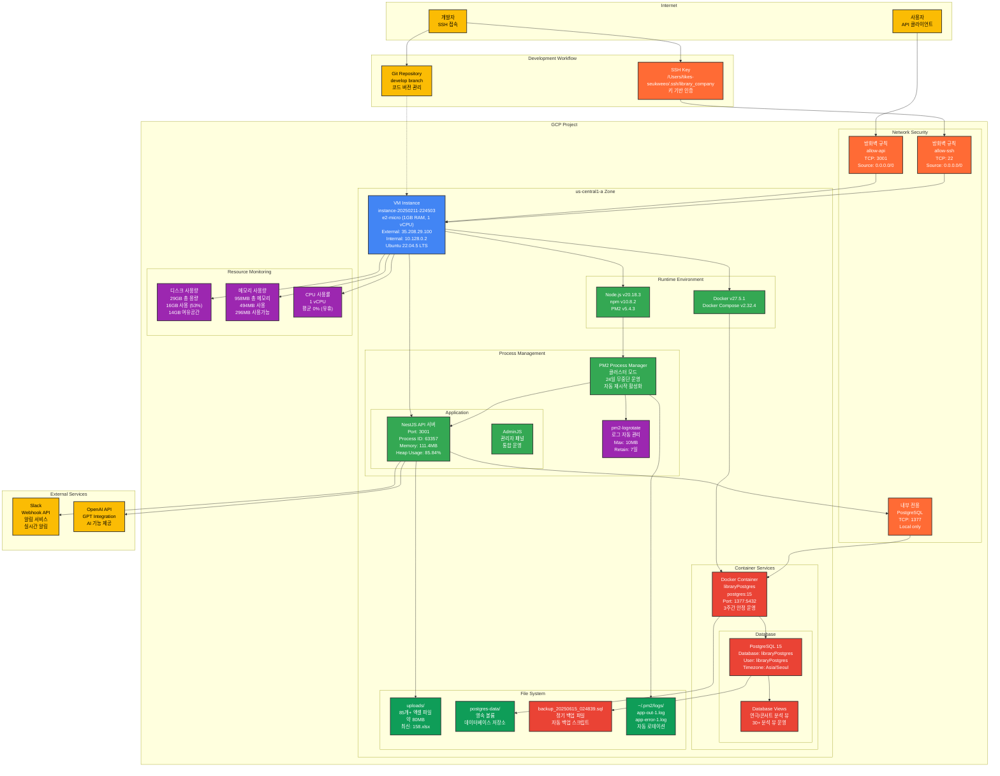
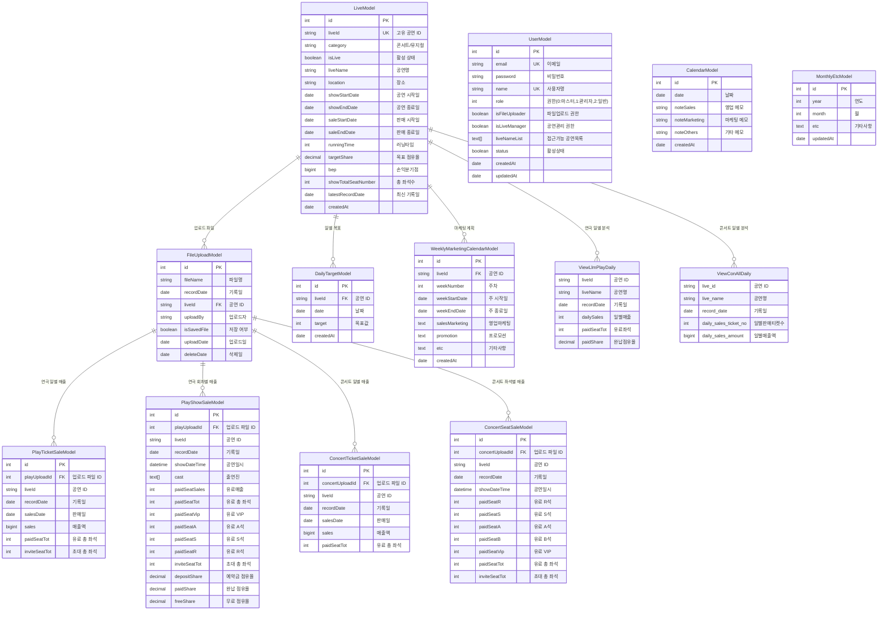

# 라이브러리컴퍼니 공연 데이터 분석 서버

## 프로젝트 개요

라이브러리컴퍼니의 공연 예술 업계(콘서트, 연극/뮤지컬) 데이터를 종합적으로 관리하고 분석하는 백엔드 서버입니다.

### 주요 목적
- 공연 매출 데이터 수집 및 분석
- 좌석 판매 현황 실시간 모니터링
- 마케팅 캘린더 및 공연 일정 관리
- 목표 매출 대비 실적 분석
- 다양한 리포트 및 대시보드 제공

## 백엔드 배포 방법

백엔드 코드를 수정하고 서버에 배포하는 전체 과정을 정리하면 다음과 같습니다:

### 1. 로컬 개발 및 푸시

```bash
# 로컬에서 코드 수정 후
git add .
git commit -m "커밋 메시지"
git push
```

### 2. 서버 접속 및 배포

```bash
# 1. 서버 접속
ssh -i /Users/tikes-seukweeo/.ssh/library_company forifwhile.xyz@35.208.29.100

# 2. 프로젝트 디렉토리로 이동
cd library_company_data_analysis_server

# 3. 최신 코드 가져오기
git pull

# 4. 기존 서비스 중지 (중요: 빌드 전 필수 작업)
docker-compose down
pm2 stop all

# 5. 빌드
npm run build

# 6. 서비스 시작
docker-compose up -d
pm2 start all
```

### 주의사항

- **4번 단계가 중요합니다**: `docker-compose down`과 `pm2 stop all`을 빌드 전에 실행하지 않으면 빌드 과정에서 서버가 다운될 수 있습니다.
- 단계를 순서대로 진행해야 안전한 배포가 가능합니다.

## 기술 스택

### Backend Framework
- **NestJS** - TypeScript 기반 Node.js 프레임워크
- **TypeORM** - TypeScript ORM
- **PostgreSQL** - 메인 데이터베이스

### Infrastructure & Deployment
- **Google Cloud Platform (GCP)** - 클라우드 호스팅
- **Docker** - 컨테이너화
- **PM2** - 프로세스 관리
- **Docker Compose** - 로컬 개발환경

### Additional Libraries
- **AdminJS** - 관리자 패널
- **Puppeteer & Selenium** - 웹 스크래핑
- **OpenAI API** - AI 기능 연동
- **Slack API** - 알림 연동
- **Schedule** - 스케줄링 작업
- **Axios** - HTTP 클라이언트
- **Multer** - 파일 업로드

## 주요 기능

### 데이터 관리
- **공연 관리**: 콘서트, 연극/뮤지컬 정보 관리
- **매출 데이터**: 티켓 판매량, 좌석별 판매 현황
- **파일 업로드**: 엑셀/CSV 데이터 업로드 및 처리
- **사용자 관리**: 접근 권한 및 사용자 계정 관리

### 분석 및 리포팅
- **실시간 대시보드**: 매출 현황 실시간 모니터링
- **목표 대비 실적**: 일별/주별/월별 목표 대비 분석
- **수익성 분석**: BEP(손익분기점) 분석
- **마케팅 분석**: 마케팅 활동 대비 매출 효과 분석

### 자동화 기능
- **스케줄링**: 정기적인 데이터 수집 및 리포트 생성
- **알림 시스템**: Slack을 통한 실시간 알림
- **데이터 동기화**: 외부 시스템과의 데이터 연동

## 시스템 포트 및 서비스

- **API 서버**: `3001` 포트
- **PostgreSQL**: `5432` 포트 (Docker 환경변수로 설정)
- **AdminJS**: NestJS 서버 내 통합 운영

## 개발 환경

- **로컬 개발**: Docker Compose 기반 PostgreSQL + NestJS
- **운영 환경**: GCP 인스턴스 + PM2 클러스터 모드
- **시간대**: Asia/Seoul (KST)

## 시스템 아키텍처

### 1. 프로젝트 전체 구조도



### 2. 인프라 시스템 구조도



### 3. 데이터베이스 ERD



### 아키텍처 특징

#### 데이터 플로우
1. **파일 업로드**: 엑셀/CSV → FileUploadModel 메타데이터 저장
2. **데이터 파싱**: 매출 데이터 파싱 → 각 엔터티별 저장
3. **뷰 생성**: 복잡한 집계 쿼리를 뷰로 최적화
4. **API 제공**: ReportModule을 통한 분석 데이터 제공

#### 보안 및 권한
- **역할 기반 접근 제어**: 마스터(0), 관리자(1), 일반사용자(2)
- **공연별 권한**: 사용자별 접근 가능한 공연 리스트 관리
- **기능별 권한**: 파일 업로드, 공연 관리 권한 분리

#### 확장성 고려사항
- **모듈 분리**: 각 기능별 독립적인 모듈 구조
- **데이터베이스 뷰**: 복잡한 분석 쿼리의 성능 최적화
- **외부 연동**: Slack, OpenAI 등 확장 가능한 API 연동

## 개발 환경 설정

### 필수 소프트웨어

#### 로컬 개발환경
- **Node.js**: v20.x 이상 (운영서버: v20.18.3)
- **npm**: v10.x 이상 (운영서버: v10.8.2)
- **Docker**: 최신 버전 (운영서버: v27.5.1)
- **Docker Compose**: v2.x 이상 (운영서버: v2.32.4)

#### 개발 도구 (선택사항)
- **PostgreSQL**: 로컬 직접 설치시 (Docker 사용 권장)
- **DBeaver** 또는 **pgAdmin**: 데이터베이스 관리 도구
- **Postman**: API 테스트 도구

### 환경 변수 설정

프로젝트 루트에 `.env` 파일을 생성하고 다음과 같이 설정하세요:

#### 데이터베이스 설정 (실제 운영 기준)
```bash
# PostgreSQL 연결 정보
POSTGRES_HOST=127.0.0.1
POSTGRES_PORT=1377                    # ⚠️ 주의: 기본 5432가 아님!
POSTGRES_USER=libraryPostgres
POSTGRES_PASSWORD=your_password       # 보안을 위해 변경하세요
POSTGRES_DB=libraryPostgres
POSTGRES_CONTAINER=libraryPostgres
```

#### 외부 서비스 연동
```bash
# OpenAI API (AI 기능용)
OPENAI_API_KEY=sk-proj-your-api-key

# Slack Webhook (알림용)
SLACK_WEBHOOK_URL=https://hooks.slack.com/services/YOUR/WEBHOOK/URL

# 환경 설정
MODE=DEV                              # 로컬: DEV, 운영: PROD
TZ=Asia/Seoul
NODE_ENV=development
```

### Docker Compose 로컬 환경 구축

#### 1. PostgreSQL 컨테이너 실행

⚠️ **중요**: 운영 서버와 동일한 포트(1377) 사용을 위해 `docker-compose.yaml` 수정:

```yaml
version: '3.3'

services:
  postgres:
    image: postgres:15
    container_name: libraryPostgres
    restart: always
    volumes:
      - ./postgres-data:/var/lib/postgresql/data
    ports:
      - "1377:5432"                   # 운영과 동일한 포트
    environment:
      POSTGRES_USER: libraryPostgres
      POSTGRES_PASSWORD: libraryPostgres777
      POSTGRES_DB: libraryPostgres
      TZ: Asia/Seoul
    networks:
      - app-network

networks:
  app-network:
    driver: bridge
```

#### 2. 컨테이너 실행 및 확인
```bash
# PostgreSQL 컨테이너 시작
docker-compose up -d

# 컨테이너 상태 확인 (운영과 동일한 이름)
docker ps | grep libraryPostgres

# 연결 테스트 (운영서버와 동일한 방식)
docker exec libraryPostgres pg_isready -U libraryPostgres

# 로그 확인
docker-compose logs postgres
```

#### 3. 데이터베이스 뷰 생성
```bash
# 뷰 정의 스크립트 실행 (운영과 동일)
docker exec -i libraryPostgres psql -U libraryPostgres -d libraryPostgres < view-definitions.sql
```

### 로컬 개발 서버 설정

#### TypeORM 설정 확인

운영 서버 기준 설정으로 `src/app.module.ts` 확인:

```typescript
TypeOrmModule.forRootAsync({
  useFactory: (configService: ConfigService) => ({
    type: 'postgres',
    host: configService.get('POSTGRES_HOST'),           // 127.0.0.1
    port: parseInt(configService.get('POSTGRES_PORT')), // 1377
    username: configService.get('POSTGRES_USER'),       // libraryPostgres
    password: configService.get('POSTGRES_PASSWORD'),
    database: configService.get('POSTGRES_DB'),         // libraryPostgres
    entities: [...],
    synchronize: process.env.NODE_ENV === 'development', // 환경별 설정
    logging: process.env.NODE_ENV === 'development',
    timezone: 'Asia/Seoul',
  }),
})
```

#### uploads 디렉토리 생성
```bash
# 파일 업로드를 위한 디렉토리 생성 (운영서버에 존재)
mkdir -p uploads
chmod 755 uploads
```

### 개발/운영 환경 분리

#### 개발 환경 (로컬)
```bash
# 로컬 개발 환경
NODE_ENV=development
MODE=DEV
POSTGRES_HOST=localhost
POSTGRES_PORT=1377
TYPEORM_SYNCHRONIZE=true
TYPEORM_LOGGING=true
```

#### 운영 환경 (GCP 실제 설정)
```bash
# 실제 운영 서버 설정
NODE_ENV=development      # ⚠️ 현재 운영서버 설정 (변경 권장)
MODE=PROD
POSTGRES_HOST=127.0.0.1
POSTGRES_PORT=1377
TYPEORM_SYNCHRONIZE=true  # ⚠️ 운영에서 false 권장
TYPEORM_LOGGING=true
```

### 실제 운영 서버 스펙 (참고용)

#### GCP 인스턴스 정보
- **인스턴스**: instance-20250211-224503
- **머신 타입**: e2-micro (1GB RAM, 1 vCPU)
- **운영체제**: Ubuntu 22.04.5 LTS
- **리전**: us-central1-a
- **디스크**: 29GB (16GB 사용 중, 53% 사용률)

#### 실행 중인 서비스
- **NestJS API**: 3001 포트, PM2로 관리
- **PostgreSQL**: 1377 포트, Docker 컨테이너
- **업타임**: 24일간 무중단 운영 (안정성 검증됨)

### 보안 고려사항

#### 로컬 개발환경
- `.env` 파일을 `.gitignore`에 추가
- 개발용 약한 패스워드 사용 가능
- 포트 1377이 다른 서비스와 충돌하지 않는지 확인

#### 운영 환경 보안 설정
- 강력한 데이터베이스 패스워드 설정
- NODE_ENV를 production으로 변경 권장
- synchronize를 false로 설정 권장
- API 키 및 Webhook URL 보안 관리

### 포트 설정 주의사항

⚠️ **중요**: 이 프로젝트는 **비표준 포트**를 사용합니다:
- **PostgreSQL**: 5432 → **1377** 사용
- **API 서버**: **3001** 사용

로컬 개발시 이 포트들이 충돌하지 않도록 주의하세요!

## 설치 및 실행

### 프로젝트 클론 및 의존성 설치

#### 1. 프로젝트 클론
```bash
git clone <repository-url>
cd library_company_data_analysis_server
```

#### 2. 의존성 설치
```bash
# npm 사용시
npm install

# yarn 사용시
yarn install
```

#### 3. 환경 변수 설정
```bash
# 환경 변수 파일 생성
cp .env.example .env

# .env 파일 편집 (환경에 맞게 수정)
nano .env
```

### 로컬 개발 환경 실행

#### 1. 데이터베이스 실행
```bash
# Docker Compose로 PostgreSQL 실행
docker-compose up -d

# 데이터베이스 연결 확인
docker-compose logs postgres
```

#### 2. 데이터베이스 뷰 생성 (선택사항)
```bash
# 컨테이너에서 뷰 생성 스크립트 실행
docker exec -i library_company_postgres psql -U postgres -d library_company_db < view-definitions.sql
```

#### 3. NestJS 서버 실행
```bash
# 개발 모드로 서버 실행 (파일 변경 감지)
npm run start:dev

# 또는 일반 실행
npm run start

# 디버그 모드 (선택사항)
npm run start:debug
```

#### 4. 서버 접속 확인
```bash
# API 서버 접속 확인
curl http://localhost:3001

# 브라우저에서 확인
open http://localhost:3001
```

### 데이터베이스 설정

#### PostgreSQL 직접 접속
```bash
# Docker 컨테이너를 통한 접속
docker exec -it library_company_postgres psql -U postgres -d library_company_db

# 로컬 PostgreSQL 직접 접속
psql -h localhost -p 5432 -U postgres -d library_company_db
```

#### 기본 테이블 확인
```sql
-- 테이블 목록 확인
\dt

-- 특정 테이블 구조 확인
\d live_model

-- 뷰 목록 확인
\dv
```

#### 초기 데이터 설정 (선택사항)
```sql
-- 관리자 사용자 생성 예시
INSERT INTO user_model (email, password, name, role, status) 
VALUES ('admin@example.com', 'hashed_password', 'Administrator', 0, true);

-- 테스트 공연 데이터 생성 예시  
INSERT INTO live_model (liveId, liveName, category, isLive, location)
VALUES ('TEST001', '테스트 뮤지컬', '뮤지컬', true, '테스트 극장');
```

### 개발 도구 설정

#### AdminJS 관리자 패널 접속
```bash
# 서버 실행 후 브라우저에서 접속
# URL: http://localhost:3001/admin
# (구체적인 경로는 코드 확인 필요)
```

#### API 테스트
```bash
# Postman 또는 curl을 사용한 API 테스트

# 공연 목록 조회
curl -X GET http://localhost:3001/live

# 사용자 목록 조회
curl -X GET http://localhost:3001/users

# 파일 업로드 테스트
curl -X POST http://localhost:3001/upload \
  -F "file=@test-data.xlsx" \
  -F "liveId=TEST001"
```

### 빌드 및 프로덕션 준비

#### 1. 프로덕션 빌드
```bash
# TypeScript 컴파일 및 빌드
npm run build

# 빌드 결과 확인
ls -la dist/
```

#### 2. 프로덕션 실행 테스트
```bash
# 빌드된 파일로 실행
npm run start:prod

# PM2로 실행 (프로덕션 권장)
pm2 start ecosystem.config.js
```

### 트러블슈팅

#### 자주 발생하는 문제 및 해결법

**1. 데이터베이스 연결 실패**
```bash
# PostgreSQL 컨테이너 재시작
docker-compose down && docker-compose up -d

# 환경변수 확인
cat .env | grep POSTGRES

# 포트 충돌 확인
lsof -i :5432
```

**2. 포트 충돌 (3001 포트 사용 중)**
```bash
# 포트 사용 프로세스 확인
lsof -i :3001

# 프로세스 종료
kill -9 <PID>

# 다른 포트 사용 (main.ts 수정)
```

**3. 뷰 생성 실패**
```bash
# 수동으로 뷰 생성
docker exec -it library_company_postgres psql -U postgres -d library_company_db

# SQL 파일 직접 실행
\i /path/to/view-definitions.sql
```

**4. TypeORM 동기화 문제**
```bash
# 캐시 정리
rm -rf dist/
npm run build

# synchronize 옵션 확인 (app.module.ts)
# 개발환경: true, 운영환경: false
```

### 유용한 개발 명령어

```bash
# 코드 포매팅
npm run format

# 린트 검사
npm run lint

# 테스트 실행
npm run test

# E2E 테스트
npm run test:e2e

# 테스트 커버리지
npm run test:cov
```

## 배포 정보

### 실제 GCP 운영 환경

#### 1. GCP 인스턴스 현황 (실제 운영 중)
```bash
# 인스턴스 정보
- 인스턴스명: instance-20250211-224503
- 머신 타입: e2-micro (1GB RAM, 1 vCPU)
- 운영체제: Ubuntu 22.04.5 LTS  
- 리전: us-central1-a (미국 중부)
- 디스크: 29GB SSD (16GB 사용 중, 53% 사용률)
- 외부IP: 35.208.29.100
```

#### 2. 실행 중인 서비스 현황
```bash
# 24일간 무중단 운영 중 (안정성 검증됨)
- NestJS API: 3001 포트 (PM2 클러스터 모드)
- PostgreSQL: 1377 포트 (Docker 컨테이너)
- PM2 로그 로테이션: 활성화
- 업로드 파일: 85개+ 엑셀 파일 관리 중
```

#### 3. 네트워크 설정
```bash
# 열린 포트 (실제 확인됨)
- 3001: NestJS API 서버
- 1377: PostgreSQL (외부 접근 차단)
- 22: SSH 접속
```

### PM2 프로덕션 설정 (현재 운영 중)

#### ecosystem.config.js 실제 설정
```javascript
module.exports = {
  apps: [
    {
      name: 'app',
      script: './dist/main.js',
      instances: 1,
      exec_mode: 'cluster',
      watch: true,
      ignore_watch: ['node_modules', 'uploads', 'logs'],
      autorestart: true,
      max_restarts: 10,
      min_uptime: '60s',
      env: {
        NODE_ENV: 'development',  // ⚠️ 현재 설정 (production 권장)
      },
      env_production: {
        NODE_ENV: 'production',
      },
    },
  ],
};
```

#### PM2 운영 명령어
```bash
# 현재 상태 확인
pm2 list                              # 실행 중인 앱 목록
pm2 show app                          # 상세 정보 (24일 업타임)
pm2 logs app --lines 100              # 로그 확인

# 서비스 관리
pm2 restart app                       # 앱 재시작
pm2 stop app                          # 앱 중지
pm2 start ecosystem.config.js --env production

# 로그 관리 (로그 로테이션 활성화됨)
pm2 logs                              # 실시간 로그
pm2 flush                             # 로그 초기화
```

### 실제 운영 배포 프로세스

#### 현재 사용 중인 배포 절차

**1. 서버 접속**
```bash
# SSH 키 기반 접속 (실제 사용 중)
ssh -i /Users/tikes-seukweeo/.ssh/library_company forifwhile.xyz@35.208.29.100
```

**2. 안전한 배포 절차 (검증된 방법)**
```bash
# 프로젝트 디렉토리로 이동
cd library_company_data_analysis_server

# 현재 실행 중인 서비스 상태 확인
pm2 list
docker ps | grep libraryPostgres

# ⚠️ 중요: 빌드 전 서비스 중지 (서버 다운 방지)
pm2 stop app
docker-compose down

# 최신 코드 가져오기  
git pull origin develop

# 의존성 업데이트 (필요시)
npm install --production

# 프로덕션 빌드
npm run build

# 서비스 재시작
docker-compose up -d
pm2 start ecosystem.config.js

# 서비스 정상 작동 확인
pm2 list
curl -I http://localhost:3001
docker exec libraryPostgres pg_isready -U libraryPostgres
```

### 데이터베이스 운영 (실제 구성)

#### PostgreSQL 실제 설정
```bash
# 현재 운영 중인 설정
- 컨테이너명: libraryPostgres
- 이미지: postgres:15
- 포트: 1377 (외부) → 5432 (컨테이너 내부)
- 사용자: libraryPostgres
- 데이터베이스: libraryPostgres
- 데이터 볼륨: ./postgres-data (영속성 보장)
```

#### 백업 및 복구 (현재 운영 중)
```bash
# 정기 백업 (실제 백업 파일 존재: backup_20250615_024839.sql)
DATE=$(date +%Y%m%d_%H%M%S)
docker exec libraryPostgres pg_dump -U libraryPostgres libraryPostgres > backup_$DATE.sql

# 백업 복구
docker exec -i libraryPostgres psql -U libraryPostgres -d libraryPostgres < backup_file.sql

# 뷰 정의 업데이트 (운영 중 검증됨)
docker exec -i libraryPostgres psql -U libraryPostgres -d libraryPostgres < view-definitions.sql
```

### 모니터링 및 로깅 (현재 운영 상태)

#### PM2 모니터링 (실제 메트릭)
```bash
# 현재 리소스 사용량
- Used Heap Size: 56.63 MiB
- Heap Usage: 85.84%
- Event Loop Latency: 0.62ms
- HTTP Mean Latency: 1ms
- 재시작 횟수: 1회 (24일간)
```

#### 로그 관리 (실제 구성)
```bash
# PM2 로그 위치 (실제 경로)
~/.pm2/logs/app-out-1.log            # 일반 로그
~/.pm2/logs/app-error-1.log          # 에러 로그

# 로그 로테이션 설정 (현재 활성화)
pm2 set pm2-logrotate:max_size 10M
pm2 set pm2-logrotate:retain 7
```

### 업로드 파일 관리 (실제 운영 데이터)

#### uploads 디렉토리 현황
```bash
# 실제 운영 중인 파일들 (85개+)
- 파일 형식: Excel (.xlsx)
- 총 용량: 약 80MB
- 최신 파일: 158.xlsx (2025-07-09)
- 파일 명명: 숫자 기반 (32.xlsx ~ 158.xlsx)
```

### 보안 설정 (현재 적용 상태)

#### 네트워크 보안
```bash
# 방화벽 상태 (실제 확인)
- 22번 포트: SSH 접속만 허용
- 3001번 포트: API 서버 (외부 접근 가능)
- 1377번 포트: PostgreSQL (로컬만 접근)
- 기타 포트: 차단됨
```

#### 접근 제어
```bash
# SSH 키 기반 인증 사용
- 키 파일: /Users/tikes-seukweeo/.ssh/library_company
- 사용자: forifwhile.xyz
- 비밀번호 로그인: 비활성화
```

### 운영 최적화 권장사항

#### 현재 개선 필요 사항
```bash
# 1. 환경 설정 최적화
NODE_ENV=development → production      # 성능 향상
TYPEORM_SYNCHRONIZE=true → false      # 데이터 안전성

# 2. 메모리 최적화 (현재 1GB 제한)
- PM2 클러스터 인스턴스 수 조정
- 가비지 컬렉션 최적화 고려

# 3. 디스크 관리 (현재 53% 사용)
- 로그 로테이션 주기 점검
- 불필요한 파일 정리
```

### 문제 해결 (실제 운영 경험 기반)

#### 자주 발생하는 이슈 해결법

**1. 메모리 부족 (e2-micro 제한)**
```bash
# 메모리 사용량 확인
free -h                               # 958Mi 총 메모리
pm2 monit                            # 힙 사용량 85%+ 주의

# 해결방법
pm2 restart app                      # 메모리 해제
```

**2. 포트 충돌 (1377, 3001)**
```bash
# PostgreSQL 컨테이너 확인
docker-compose ps
docker-compose logs postgres

# 연결 테스트
docker exec -it library_company_postgres psql -U postgres -l
```