# 라이브러리컴퍼니 공연 데이터 분석 서버

## 프로젝트 개요

라이브러리컴퍼니의 공연 예술 업계(콘서트, 연극/뮤지컬) 데이터를 종합적으로 관리하고 분석하는 백엔드 서버입니다.

### 주요 목적
- 공연 매출 데이터 수집 및 분석
- 좌석 판매 현황 실시간 모니터링
- 마케팅 캘린더 및 공연 일정 관리
- 목표 매출 대비 실적 분석
- 다양한 리포트 및 대시보드 제공

### 서버 정보
- **개발 서버**: `http://localhost:3001`
- **프로덕션 서버**: `http://35.208.29.100:3001`
- **Swagger 문서**: `http://35.208.29.100:3001/api`
- **운영 현황**: 24일간 무중단 운영 (안정성 검증됨)

## 기술 스택

### Backend Framework
- **NestJS** - TypeScript 기반 Node.js 프레임워크
- **TypeORM** - TypeScript ORM
- **PostgreSQL** - 메인 데이터베이스
- **Swagger** - API 문서화

### Infrastructure & Deployment
- **Google Cloud Platform (GCP)** - 클라우드 호스팅
- **Docker** - 컨테이너화 (PostgreSQL)
- **PM2** - 프로세스 관리 및 클러스터링
- **Docker Compose** - 로컬 개발환경

### Additional Libraries
- **AdminJS** - 관리자 패널
- **Puppeteer & Selenium** - 웹 스크래핑
- **OpenAI API** - AI 기능 연동
- **Slack API** - 알림 연동
- **Schedule** - 스케줄링 작업
- **Axios** - HTTP 클라이언트
- **Multer** - 파일 업로드

## 주요 기능

### 데이터 관리
- **공연 관리**: 콘서트, 연극/뮤지컬 정보 관리
- **매출 데이터**: 티켓 판매량, 좌석별 판매 현황
- **파일 업로드**: 엑셀/CSV 데이터 업로드 및 처리 (85개+ 파일 관리)
- **사용자 관리**: 접근 권한 및 사용자 계정 관리

### 분석 및 리포팅
- **실시간 대시보드**: 매출 현황 실시간 모니터링
- **목표 대비 실적**: 일별/주별/월별 목표 대비 분석
- **수익성 분석**: BEP(손익분기점) 분석
- **마케팅 분석**: 마케팅 활동 대비 매출 효과 분석

### 자동화 기능
- **스케줄링**: 정기적인 데이터 수집 및 리포트 생성
- **알림 시스템**: Slack을 통한 실시간 알림
- **데이터 동기화**: 외부 시스템과의 데이터 연동

## 시스템 아키텍처

### 전체 시스템 구조도

```mermaid
graph TB
    subgraph "Frontend Layer"
        A1["Vercel Frontend<br/>https://librarycompany-data-analysis.vercel.app"]
        A2["관리자 웹 콘솔<br/>AdminJS"]
        A3["API 문서<br/>Swagger UI<br/>/api"]
    end
    
    subgraph "API Gateway Layer"
        B["NestJS Application<br/>Port: 3001<br/>CORS 설정<br/>Swagger 통합"]
    end
    
    subgraph "Application Layer"
        subgraph "Core Modules"
            C1["AppModule<br/>메인 모듈<br/>전역 설정"]
            C2["UploadModule<br/>파일 업로드<br/>엑셀 파싱"]
            C3["UsersModule<br/>사용자 관리<br/>권한 제어"]
            C4["LiveModule<br/>공연 관리<br/>공연 정보"]
        end
        
        subgraph "Business Modules"
            D1["ConcertModule<br/>콘서트 분석<br/>매출/BEP 분석"]
            D2["PlayModule<br/>연극/뮤지컬<br/>공연 데이터"]
            D3["ReportModule<br/>리포트 생성<br/>AI 분석 연동"]
            D4["TargetModule<br/>목표 관리<br/>실적 비교"]
        end
        
        subgraph "Support Modules"
            E1["SlackModule<br/>알림 서비스<br/>Webhook 연동"]
            E2["CalendarModule<br/>일정 관리<br/>마케팅 캘린더"]
            E3["MarketingModule<br/>마케팅 분석<br/>프로모션 관리"]
            E4["ViewModule<br/>데이터 뷰<br/>조회 최적화"]
            E5["LocalScheduleModule<br/>스케줄러<br/>정기 작업"]
        end
    end
    
    subgraph "Data Layer"
        F["PostgreSQL Database<br/>Port: 1377<br/>Container: libraryPostgres"]
        
        subgraph "Database Views (30+)"
            G1["Concert Views<br/>view_con_*<br/>콘서트 분석 뷰"]
            G2["Play Views<br/>view_llm_play_*<br/>연극 분석 뷰"]
            G3["Marketing Views<br/>마케팅 분석 뷰"]
        end
        
        subgraph "Core Tables"
            H1["LiveModel<br/>공연 정보"]
            H2["FileUploadModel<br/>파일 업로드"]
            H3["UserModel<br/>사용자 정보"]
            H4["Sales Tables<br/>매출 데이터"]
        end
    end
    
    subgraph "External Services"
        I1["OpenAI API<br/>GPT Integration<br/>AI 분석"]
        I2["Slack API<br/>Webhook 알림<br/>실시간 notification"]
    end
    
    subgraph "Infrastructure"
        J1["PM2 Process Manager<br/>클러스터 모드<br/>무중단 운영"]
        J2["Docker Container<br/>PostgreSQL 컨테이너<br/>영속 볼륨"]
        J3["File System<br/>uploads/ 디렉토리<br/>85+ 엑셀 파일"]
    end
    
    %% Frontend to API
    A1 --> B
    A2 --> B
    A3 --> B
    
    %% API to Core Modules
    B --> C1
    C1 --> C2
    C1 --> C3
    C1 --> C4
    
    %% Core to Business Modules
    C1 --> D1
    C1 --> D2
    C1 --> D3
    C1 --> D4
    
    %% Core to Support Modules
    C1 --> E1
    C1 --> E2
    C1 --> E3
    C1 --> E4
    C1 --> E5
    
    %% Database Connections
    C2 --> F
    C3 --> F
    C4 --> F
    D1 --> F
    D2 --> F
    D3 --> F
    D4 --> F
    E2 --> F
    E3 --> F
    
    %% Database Internal Structure
    F --> G1
    F --> G2
    F --> G3
    F --> H1
    F --> H2
    F --> H3
    F --> H4
    
    %% External Service Connections
    D3 --> I1
    E1 --> I2
    
    %% Infrastructure
    B --> J1
    F --> J2
    C2 --> J3
    
    %% Styling
    classDef frontend fill:#e3f2fd,stroke:#1976d2,stroke-width:2px
    classDef api fill:#f3e5f5,stroke:#7b1fa2,stroke-width:2px
    classDef core fill:#e8f5e8,stroke:#388e3c,stroke-width:2px
    classDef business fill:#fff3e0,stroke:#f57c00,stroke-width:2px
    classDef support fill:#fce4ec,stroke:#c2185b,stroke-width:2px
    classDef database fill:#e0f2f1,stroke:#00695c,stroke-width:2px
    classDef external fill:#fff8e1,stroke:#ffa000,stroke-width:2px
    classDef infra fill:#f1f8e9,stroke:#558b2f,stroke-width:2px
    
    class A1,A2,A3 frontend
    class B api
    class C1,C2,C3,C4 core
    class D1,D2,D3,D4 business
    class E1,E2,E3,E4,E5 support
    class F,G1,G2,G3,H1,H2,H3,H4 database
    class I1,I2 external
    class J1,J2,J3 infra
```



### 인프라 구조도

```mermaid
graph TB
    subgraph "Internet"
        U["사용자<br/>브라우저/API 클라이언트"]
        DEV["개발자<br/>SSH 접속"]
        VERCEL["Vercel Frontend<br/>https://librarycompany-data-analysis.vercel.app"]
    end
    
    subgraph "GCP Project (us-central1-a)"
        subgraph "Network Security"
            FW1["방화벽 규칙<br/>SSH (22)"]
            FW2["방화벽 규칙<br/>API (3001)"]
            FW3["내부 접근<br/>PostgreSQL (1377)"]
        end
        
        subgraph "VM Instance (e2-micro)"
            VM["instance-20250211-224503<br/>External: 35.208.29.100<br/>Internal: 10.128.0.2<br/>Ubuntu 22.04.5 LTS<br/>1GB RAM, 1 vCPU"]
            
            subgraph "Runtime Environment"
                NODE["Node.js v20.18.3<br/>npm v10.8.2"]
                DOCKER["Docker v27.5.1<br/>Docker Compose v2.32.4"]
                PM2_ENV["PM2 v5.4.3<br/>프로세스 관리자"]
            end
            
            subgraph "Application Stack"
                PM2["PM2 클러스터<br/>24일 연속 운영<br/>자동 재시작"]
                NESTJS["NestJS API<br/>Port: 3001<br/>Memory: 111.4MB<br/>Heap: 85.84%"]
                SWAGGER["Swagger UI<br/>/api<br/>API 문서화"]
            end
            
            subgraph "Database Container"
                POSTGRES_DOCKER["Docker Container<br/>libraryPostgres<br/>postgres:15"]
                POSTGRES_DB["PostgreSQL DB<br/>User: libraryPostgres<br/>DB: libraryPostgres<br/>Port: 1377:5432"]
            end
            
            subgraph "File System"
                UPLOADS["uploads/<br/>85+ Excel files<br/>~80MB storage"]
                POSTGRES_DATA["postgres-data/<br/>영속 볼륨<br/>DB 데이터"]
                LOGS["PM2 Logs<br/>자동 로테이션<br/>10MB max"]
            end
        end
    end
    
    subgraph "External APIs"
        SLACK_API["Slack API<br/>Webhook 알림<br/>실시간 notification"]
        OPENAI_API["OpenAI API<br/>GPT Integration<br/>AI 분석 기능"]
    end
    
    %% Network Flow
    U -->|HTTPS/HTTP| VERCEL
    VERCEL -->|API Calls| FW2
    U -->|Direct API| FW2
    FW2 --> VM
    
    DEV -->|SSH| FW1
    FW1 --> VM
    
    %% Internal Architecture
    VM --> NODE
    VM --> DOCKER
    VM --> PM2_ENV
    
    NODE --> PM2
    PM2 --> NESTJS
    NESTJS --> SWAGGER
    
    DOCKER --> POSTGRES_DOCKER
    POSTGRES_DOCKER --> POSTGRES_DB
    
    %% Database Access
    NESTJS -->|Local Connection| FW3
    FW3 --> POSTGRES_DOCKER
    
    %% File System Access
    NESTJS --> UPLOADS
    POSTGRES_DOCKER --> POSTGRES_DATA
    PM2 --> LOGS
    
    %% External Service Integration
    NESTJS --> SLACK_API
    NESTJS --> OPENAI_API
    
    %% Styling
    classDef internet fill:#e3f2fd,stroke:#1976d2,stroke-width:2px
    classDef gcp fill:#4285f4,stroke:#fff,stroke-width:2px,color:#fff
    classDef security fill:#ff6b35,stroke:#fff,stroke-width:2px,color:#fff
    classDef vm fill:#34a853,stroke:#fff,stroke-width:2px,color:#fff
    classDef app fill:#ea4335,stroke:#fff,stroke-width:2px,color:#fff
    classDef database fill:#0f9d58,stroke:#fff,stroke-width:2px,color:#fff
    classDef external fill:#fbbc04,stroke:#333,stroke-width:2px
    
    class U,DEV,VERCEL internet
    class FW1,FW2,FW3 security
    class VM,NODE,DOCKER,PM2_ENV vm
    class PM2,NESTJS,SWAGGER app
    class POSTGRES_DOCKER,POSTGRES_DB database
    class UPLOADS,POSTGRES_DATA,LOGS database
    class SLACK_API,OPENAI_API external
```



### 데이터 파이프라인

```mermaid
graph TD
    subgraph "Data Input Layer"
        A1["Excel 파일 업로드<br/>POST /upload/play-excel"]
        A2["사용자 입력<br/>목표/마케팅 설정"]
        A3["외부 데이터<br/>LLM"]
    end
    
    subgraph "Data Processing Layer"
        B1["파일명 파싱<br/>날짜/공연ID 추출"]
        B2["카테고리 분류<br/>콘서트/연극/뮤지컬"]
        B3["데이터 정규화<br/>타입 검증"]
        B4["중복 데이터 처리<br/>최신 데이터 유지"]
    end
    
    subgraph "Data Storage Layer"
        C1["Core Tables<br/>LiveModel (공연 정보)<br/>FileUploadModel (메타데이터)<br/>UserModel (사용자)"]
        C2["Concert Data<br/>ConcertTicketSaleModel<br/>ConcertSeatSaleModel"]
        C3["Play Data<br/>PlayTicketSaleModel<br/>PlayShowSaleModel"]
        C4["Management Data<br/>DailyTargetModel<br/>WeeklyMarketingCalendarModel<br/>CalendarModel"]
    end
    
    subgraph "Data Analysis Layer"
        D1["Real-time Views (30+)<br/>view_con_* (콘서트 분석)<br/>view_llm_play_* (연극 분석)<br/>자동 집계 및 계산"]
        D2["Business Logic<br/>BEP 분석<br/>수익성 계산<br/>점유율 분석"]
        D3["AI Processing<br/>OpenAI 연동<br/>예측 분석<br/>인사이트 생성"]
    end
    
    subgraph "Data Output Layer"
        E1["REST API<br/>30+ 엔드포인트<br/>JSON 응답<br/>Swagger 문서화"]
        E2["Real-time Dashboard<br/>Frontend 연동<br/>차트/테이블 데이터<br/>실시간 업데이트"]
        E3["Notification System<br/>Slack Webhook<br/>일일/주간 리포트<br/>알림 전송"]
        E4["File Downloads<br/>Excel 다운로드<br/>원본 파일 제공<br/>백업 기능"]
    end
    
    %% Data Flow
    A1 --> B1
    A2 --> B3
    A3 --> D3
    
    B1 --> B2
    B2 --> B3
    B3 --> B4
    
    B4 --> C1
    B2 -->|콘서트| C2
    B2 -->|연극/뮤지컬| C3
    A2 --> C4
    
    C1 --> D1
    C2 --> D1
    C3 --> D1
    C4 --> D1
    
    D1 --> D2
    D2 --> D3
    
    D1 --> E1
    D2 --> E1
    D3 --> E1
    
    E1 --> E2
    E1 --> E3
    C1 --> E4
    
    %% Styling
    classDef input fill:#e8f5e8,stroke:#4caf50,stroke-width:2px
    classDef process fill:#fff3e0,stroke:#ff9800,stroke-width:2px
    classDef storage fill:#e3f2fd,stroke:#2196f3,stroke-width:2px
    classDef analysis fill:#f3e5f5,stroke:#9c27b0,stroke-width:2px
    classDef output fill:#ffebee,stroke:#f44336,stroke-width:2px
    
    class A1,A2,A3 input
    class B1,B2,B3,B4 process
    class C1,C2,C3,C4 storage
    class D1,D2,D3 analysis
    class E1,E2,E3,E4 output
```



### 데이터베이스 ERD


### 아키텍처 특징

#### 모듈화된 아키텍처
- **도메인 분리**: Concert, Play, Upload 등 각 도메인별 독립 모듈
- **의존성 관리**: 순환 참조 방지 및 명확한 모듈 경계
- **확장성**: 새로운 분석 모듈 추가 용이

#### 데이터 처리 파이프라인
- **데이터 수집**: Excel 업로드 → 파싱 → 정규화 → 저장
- **실시간 분석**: 데이터베이스 뷰를 통한 즉시 분석
- **AI 연동**: OpenAI API를 통한 지능형 분석

#### 성능 최적화
- **뷰 기반 분석**: 30+ 데이터베이스 뷰로 복잡한 쿼리 최적화
- **캐싱 전략**: TypeORM 엔티티 캐싱 및 뷰 기반 데이터 제공
- **무중단 운영**: PM2 클러스터 모드로 24시간 안정 서비스

## API 엔드포인트

### 🎭 콘서트 관련 API

#### 일반 데이터 조회
- `GET /concert/daily` - 콘서트 일일 매출 데이터
- `GET /concert/monthly` - 콘서트 월간 매출 데이터 (차트용)
- `GET /concert/weekly` - 콘서트 주간 매출 데이터 (마케팅 정보 포함)

#### 분석 데이터 조회
- `GET /concert/overview` - 콘서트 전체 개요 (어제/누적/주간 매출)
- `GET /concert/bep` - 콘서트 BEP (손익분기점) 분석
- `GET /concert/estimated-profit` - 콘서트 예상 수익
- `GET /concert/target-sales` - 콘서트 목표 매출 대비 실적
- `GET /concert/marketing-calendar` - 콘서트 주간 마케팅 캘린더

### 🎪 연극/뮤지컬 관련 API

#### 데이터 조회
- `GET /report/llm-play-daily` - 연극 일일 매출 데이터
- `GET /report/llm-play-weekly-a` - 연극 주간 매출 데이터 (A 타입)
- `GET /report/llm-play-weekly-b` - 연극 주간 매출 데이터 (B 타입)
- `GET /report/llm-play-weekly-c` - 연극 주간 매출 데이터 (C 타입)
- `GET /report/llm-play-weekly-d` - 연극 주간 매출 데이터 (D 타입)
- `GET /report/llm-play-est-profit` - 연극 예상 수익
- `GET /report/llm-play-weekly-paidshare` - 연극 주간 유료 점유율

### 👥 사용자 관리 API

- `GET /users/get-users` - 사용자 목록 조회
- `POST /users` - 사용자 생성
- `PATCH /users/:id` - 사용자 정보 수정
- `DELETE /users/:id` - 사용자 삭제

### 🎪 공연 관리 API

- `GET /live` - 공연 목록 조회
- `POST /live` - 공연 생성
- `PATCH /live/:id` - 공연 정보 수정
- `DELETE /live/:id` - 공연 삭제

### 📁 파일 업로드 API

- `POST /upload` - 파일 업로드
- `GET /upload` - 업로드 파일 목록 조회
- `DELETE /upload/:id` - 업로드 파일 삭제

### 🎯 목표 관리 API

- `GET /target` - 목표 설정 조회
- `POST /target` - 목표 설정
- `PATCH /target/:id` - 목표 수정

### 📅 캘린더 API

- `GET /calendar` - 캘린더 일정 조회
- `POST /calendar` - 일정 생성
- `PATCH /calendar/:id` - 일정 수정

### 📊 마케팅 API

- `GET /marketing` - 마케팅 캘린더 조회
- `POST /marketing` - 마케팅 일정 생성
- `PATCH /marketing/:id` - 마케팅 일정 수정

### 🔔 알림 API

- `POST /slack` - Slack 알림 전송
- `GET /slack` - 알림 내역 조회

## 개발 환경 설정

### 필수 소프트웨어

#### 로컬 개발환경
- **Node.js**: v20.x 이상 (운영서버: v20.18.3)
- **npm**: v10.x 이상 (운영서버: v10.8.2)
- **Docker**: 최신 버전 (운영서버: v27.5.1)
- **Docker Compose**: v2.x 이상 (운영서버: v2.32.4)

#### 개발 도구 (선택사항)
- **PostgreSQL**: 로컬 직접 설치시 (Docker 사용 권장)
- **DBeaver** 또는 **pgAdmin**: 데이터베이스 관리 도구
- **Postman**: API 테스트 도구

### 환경 변수 설정

프로젝트 루트에 `.env` 파일을 생성하고 다음과 같이 설정하세요:

#### 데이터베이스 설정 (실제 운영 기준)
```bash
# PostgreSQL 연결 정보
POSTGRES_HOST=127.0.0.1
POSTGRES_PORT=1377                    # ⚠️ 주의: 기본 5432가 아님!
POSTGRES_USER=libraryPostgres
POSTGRES_PASSWORD=your_password       # 보안을 위해 변경하세요
POSTGRES_DB=libraryPostgres
POSTGRES_CONTAINER=libraryPostgres
```

#### 외부 서비스 연동
```bash
# OpenAI API (AI 기능용)
OPENAI_API_KEY=sk-proj-your-api-key

# Slack Webhook (알림용)
SLACK_WEBHOOK_URL=https://hooks.slack.com/services/YOUR/WEBHOOK/URL

# 환경 설정
MODE=DEV                              # 로컬: DEV, 운영: PROD
TZ=Asia/Seoul
NODE_ENV=development
```

### Docker Compose 로컬 환경 구축

#### 1. PostgreSQL 컨테이너 실행

⚠️ **중요**: 운영 서버와 동일한 포트(1377) 사용을 위해 `docker-compose.yaml` 수정:

```yaml
version: '3.3'

services:
  postgres:
    image: postgres:15
    container_name: libraryPostgres
    restart: always
    volumes:
      - ./postgres-data:/var/lib/postgresql/data
    ports:
      - "1377:5432"                   # 운영과 동일한 포트
    environment:
      POSTGRES_USER: libraryPostgres
      POSTGRES_PASSWORD: libraryPostgres777
      POSTGRES_DB: libraryPostgres
      TZ: Asia/Seoul
    networks:
      - app-network

networks:
  app-network:
    driver: bridge
```

#### 2. 컨테이너 실행 및 확인
```bash
# PostgreSQL 컨테이너 시작
docker-compose up -d

# 컨테이너 상태 확인 (운영과 동일한 이름)
docker ps | grep libraryPostgres

# 연결 테스트 (운영서버와 동일한 방식)
docker exec libraryPostgres pg_isready -U libraryPostgres

# 로그 확인
docker-compose logs postgres
```

#### 3. 데이터베이스 뷰 생성
```bash
# 뷰 정의 스크립트 실행 (운영과 동일)
docker exec -i libraryPostgres psql -U libraryPostgres -d libraryPostgres < view-definitions.sql
```

### 로컬 개발 서버 설정

#### uploads 디렉토리 생성
```bash
# 파일 업로드를 위한 디렉토리 생성 (운영서버에 존재)
mkdir -p uploads
chmod 755 uploads
```

### 설치 및 실행

#### 1. 프로젝트 클론
```bash
git clone <repository-url>
cd library_company_data_analysis_server
```

#### 2. 의존성 설치
```bash
# npm 사용시
npm install

# yarn 사용시
yarn install
```

#### 3. 환경 변수 설정
```bash
# 환경 변수 파일 생성
cp .env.example .env

# .env 파일 편집 (환경에 맞게 수정)
nano .env
```

#### 4. 데이터베이스 실행
```bash
# Docker Compose로 PostgreSQL 실행
docker-compose up -d

# 데이터베이스 연결 확인
docker-compose logs postgres
```

#### 5. NestJS 서버 실행
```bash
# 개발 모드로 서버 실행 (파일 변경 감지)
npm run start:dev

# 또는 일반 실행
npm run start

# 디버그 모드 (선택사항)
npm run start:debug
```

#### 6. 서버 접속 확인
```bash
# API 서버 접속 확인
curl http://localhost:3001

# 브라우저에서 확인
open http://localhost:3001
```

### 포트 설정 주의사항

⚠️ **중요**: 이 프로젝트는 **비표준 포트**를 사용합니다:
- **PostgreSQL**: 5432 → **1377** 사용
- **API 서버**: **3001** 사용

로컬 개발시 이 포트들이 충돌하지 않도록 주의하세요!

## 배포 가이드

### 실제 GCP 운영 환경

#### 1. GCP 인스턴스 현황 (실제 운영 중)
```bash
# 인스턴스 정보
- 인스턴스명: instance-20250211-224503
- 머신 타입: e2-micro (1GB RAM, 1 vCPU)
- 운영체제: Ubuntu 22.04.5 LTS  
- 리전: us-central1-a (미국 중부)
- 디스크: 29GB SSD (16GB 사용 중, 53% 사용률)
- 외부IP: 35.208.29.100
```

#### 2. 실행 중인 서비스 현황
```bash
# 24일간 무중단 운영 중 (안정성 검증됨)
- NestJS API: 3001 포트 (PM2 클러스터 모드)
- PostgreSQL: 1377 포트 (Docker 컨테이너)
- PM2 로그 로테이션: 활성화
- 업로드 파일: 85개+ 엑셀 파일 관리 중
```

### 배포 절차

#### 1. 로컬 개발 및 푸시

```bash
# 로컬에서 코드 수정 후
git add .
git commit -m "커밋 메시지"
git push
```

#### 2. 서버 접속 및 배포

```bash
# 1. 서버 접속
ssh -i /Users/tikes-seukweeo/.ssh/library_company forifwhile.xyz@35.208.29.100

# 2. 프로젝트 디렉토리로 이동
cd library_company_data_analysis_server

# 3. 최신 코드 가져오기
git pull

# 4. 기존 서비스 중지 (중요: 빌드 전 필수 작업)
docker-compose down
pm2 stop all

# 5. 빌드
npm run build

# 6. 서비스 시작
docker-compose up -d
pm2 start all
```

### 주의사항

- **4번 단계가 중요합니다**: `docker-compose down`과 `pm2 stop all`을 빌드 전에 실행하지 않으면 빌드 과정에서 서버가 다운될 수 있습니다.
- 단계를 순서대로 진행해야 안전한 배포가 가능합니다.

### PM2 프로덕션 설정 (현재 운영 중)

#### ecosystem.config.js 실제 설정
```javascript
module.exports = {
  apps: [
    {
      name: 'app',
      script: './dist/main.js',
      instances: 1,
      exec_mode: 'cluster',
      watch: true,
      ignore_watch: ['node_modules', 'uploads', 'logs'],
      autorestart: true,
      max_restarts: 10,
      min_uptime: '60s',
      env: {
        NODE_ENV: 'development',  // ⚠️ 현재 설정 (production 권장)
      },
      env_production: {
        NODE_ENV: 'production',
      },
    },
  ],
};
```

#### PM2 운영 명령어
```bash
# 현재 상태 확인
pm2 list                              # 실행 중인 앱 목록
pm2 show app                          # 상세 정보 (24일 업타임)
pm2 logs app --lines 100              # 로그 확인

# 서비스 관리
pm2 restart app                       # 앱 재시작
pm2 stop app                          # 앱 중지
pm2 start ecosystem.config.js --env production

# 로그 관리 (로그 로테이션 활성화됨)
pm2 logs                              # 실시간 로그
pm2 flush                             # 로그 초기화
```

### 데이터베이스 운영 (실제 구성)

#### PostgreSQL 실제 설정
```bash
# 현재 운영 중인 설정
- 컨테이너명: libraryPostgres
- 이미지: postgres:15
- 포트: 1377 (외부) → 5432 (컨테이너 내부)
- 사용자: libraryPostgres
- 데이터베이스: libraryPostgres
- 데이터 볼륨: ./postgres-data (영속성 보장)
```

#### 백업 및 복구 (현재 운영 중)
```bash
# 정기 백업 (실제 백업 파일 존재: backup_20250615_024839.sql)
DATE=$(date +%Y%m%d_%H%M%S)
docker exec libraryPostgres pg_dump -U libraryPostgres libraryPostgres > backup_$DATE.sql

# 백업 복구
docker exec -i libraryPostgres psql -U libraryPostgres -d libraryPostgres < backup_file.sql

# 뷰 정의 업데이트 (운영 중 검증됨)
docker exec -i libraryPostgres psql -U libraryPostgres -d libraryPostgres < view-definitions.sql
```

## 사용 가이드

### 콘서트 대시보드 API 사용 가이드

#### 1. 좌석별 수입 현황 테이블
```javascript
// API 호출
const bepData = await fetch(`${API_BASE_URL}/concert/bep`)
  .then(res => res.json())
  .then(data => data.filter(item => item.liveId === selectedLiveId));

// 데이터 매핑
const tableData = bepData.map(item => ({
  좌석등급: item.seatClass,
  전석: item.totalSeats,
  판매: item.soldSeats,
  초대: item.totalSeats - item.soldSeats - item.remainingSeats,
  잔여: item.remainingSeats,
  추가판매예상: parseInt(item.estAdditionalSales),
  최종잔여예상: parseInt(item.estFinalRemaining),
  'BEP %': (item.bepRatio * 100).toFixed(1) + '%'
}));
```

#### 2. 일간 매출 차트
```javascript
// API 호출
const dailyData = await fetch(`${API_BASE_URL}/concert/daily`)
  .then(res => res.json())
  .then(data => data.filter(item => item.liveId === selectedLiveId));

// 차트 데이터
const chartData = {
  labels: dailyData.map(item => item.recordDate),
  datasets: [{
    label: '일간 매출',
    data: dailyData.map(item => item.dailySalesAmount),
    backgroundColor: '#4CAF50'
  }]
};
```

#### 3. 주간 매출 표
```javascript
// API 호출
const weeklyData = await fetch(`${API_BASE_URL}/concert/weekly`)
  .then(res => res.json())
  .then(data => data.filter(item => item.liveId === selectedLiveId));

// 테이블 데이터
const weeklyTableData = weeklyData.map(item => ({
  '주 시작일': item.recordWeek,
  '세일즈': item.noteSalesMarketing,
  '프로모션': item.notePromotion,
  '기타': item.noteEtc,
  '매출': item.weeklySalesAmount.toLocaleString() + '원',
  '판매 매수': item.weeklySalesTicketNo + '매'
}));
```

### BEP 분석 활용

#### BEP 분석 데이터
```javascript
// /concert/bep 응답 데이터 분석
const bepAnalysis = {
  현재판매율: (soldSeats / totalSeats * 100).toFixed(1) + '%',
  BEP달성률: (bepRatio * 100).toFixed(1) + '%',
  예상판매율: (estSalesRatio * 100).toFixed(1) + '%',
  수익성상태: bepRatio >= 1.0 ? '목표 달성' : '목표 미달',
  추가판매필요: Math.max(0, parseFloat(bepSeats) - soldSeats) + '석'
};
```

### 에러 핸들링
```javascript
// API 호출 시 에러 처리
const fetchConcertData = async (endpoint) => {
  try {
    const response = await fetch(`${API_BASE_URL}${endpoint}`);
    if (!response.ok) {
      throw new Error(`HTTP error! status: ${response.status}`);
    }
    return await response.json();
  } catch (error) {
    console.error('API 호출 실패:', error);
    return [];
  }
};
```

## 트러블슈팅

### 자주 발생하는 문제 및 해결법

#### 1. 데이터베이스 연결 실패
```bash
# PostgreSQL 컨테이너 재시작
docker-compose down && docker-compose up -d

# 환경변수 확인
cat .env | grep POSTGRES

# 포트 충돌 확인
lsof -i :1377
```

#### 2. 포트 충돌 (3001 포트 사용 중)
```bash
# 포트 사용 프로세스 확인
lsof -i :3001

# 프로세스 종료
kill -9 <PID>
```

#### 3. 메모리 부족 (e2-micro 제한)
```bash
# 메모리 사용량 확인
free -h                               # 958Mi 총 메모리
pm2 monit                            # 힙 사용량 85%+ 주의

# 해결방법
pm2 restart app                      # 메모리 해제
```

### 유용한 개발 명령어

```bash
# 코드 포매팅
npm run format

# 린트 검사
npm run lint

# 테스트 실행
npm run test

# E2E 테스트
npm run test:e2e

# 테스트 커버리지
npm run test:cov
```

## 최신 업데이트 내역

### 2025.07.10 - Concert Dashboard API 완료
- 콘서트 대시보드 API 전체 구현 완료
- 주간 매출 API (`/concert/weekly`) 추가
- BEP 분석 및 예상 수익 API 구현
- 마케팅 캘린더 연동 기능 추가
- 프로덕션 서버 안정 운영 (24일 무중단)

### 2025.07.09 - 시스템 아키텍처 문서화
- 전체 시스템 아키텍처 다이어그램 작성
- 인프라 구조도 상세 문서화
- 데이터베이스 ERD 업데이트
- API 엔드포인트 통합 정리

---

**📞 지원 및 문의**
- 개발자: jwlee-ticket
- 이메일: jwlee0305@ticketsquare.co.kr
- 서버 IP: 35.208.29.100:3001